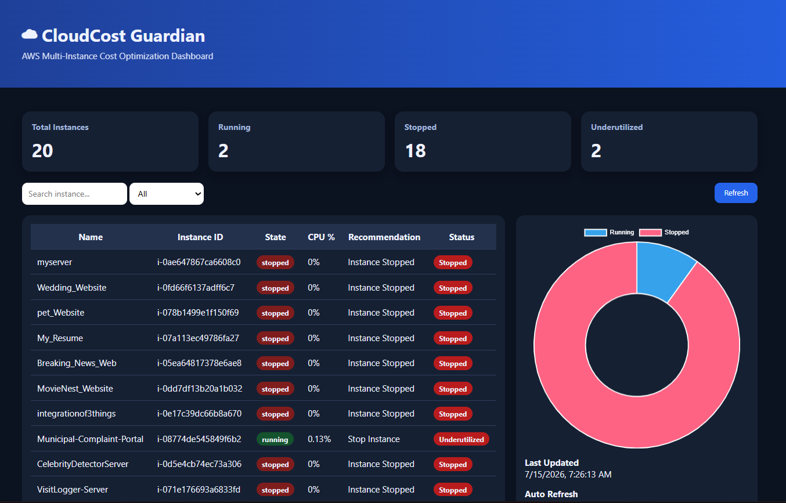

# ☁️ CloudCost Guardian - AWS Multi-Instance Cost Optimization System


---

# 📌 Project Overview

CloudCost Guardian is a serverless AWS monitoring application that continuously monitors all EC2 instances in an AWS account.

The system automatically analyzes CloudWatch CPU utilization metrics, identifies underutilized EC2 instances, stores monitoring data in DynamoDB, sends email notifications using Amazon SNS, and displays the complete monitoring information on a real-time web dashboard.

This project demonstrates the practical implementation of multiple AWS cloud services working together to optimize cloud infrastructure costs.

---

# 🎯 Project Objectives

- Monitor all EC2 instances in an AWS account
- Fetch real-time CPU utilization from Amazon CloudWatch
- Identify underutilized EC2 instances
- Send email alerts using Amazon SNS
- Store monitoring history in Amazon DynamoDB
- Maintain the latest EC2 status
- Display all monitoring information on a web dashboard
- Reduce unnecessary AWS infrastructure costs

---

# 🏗️ System Architecture


---

# 🔄 Project Workflow


---

# ☁️ AWS Services Used

- Amazon EC2
- AWS Lambda
- Amazon CloudWatch
- Amazon DynamoDB
- Amazon SNS
- Amazon API Gateway
- IAM
- Apache Web Server (Ubuntu EC2)

---

# ✨ Features

✅ Automatic EC2 Discovery

- Detects all EC2 instances automatically

---

✅ Real-Time CPU Monitoring

- Reads CPU utilization from Amazon CloudWatch

---

✅ Intelligent Cost Optimization

If CPU Utilization < 10%

→ Recommend stopping or resizing the EC2 instance.

---

✅ Email Notifications

Amazon SNS sends an email alert whenever an underutilized running instance is detected.

---

✅ Monitoring History

Stores every monitoring cycle in DynamoDB.

Table:

```
EC2MonitoringLogs
```

---

✅ Current Instance Status

Maintains the latest status of every EC2 instance.

Table:

```
EC2CurrentStatus
```

---

✅ CloudWatch Custom Metrics

Publishes custom monitoring metrics:

- RunningInstances
- StoppedInstances
- UnderutilizedInstances

---

✅ REST API

Amazon API Gateway exposes Lambda through REST endpoints.

---

✅ Live Dashboard

Displays

- Total EC2 Instances
- Running Instances
- Stopped Instances
- Underutilized Instances
- CPU Utilization
- Recommendations
- Search & Filter
- Auto Refresh

---

# 📂 Project Structure

```
CloudCostGuardian-AWS/
│
├── README.md
├── LICENSE
├── lambda_function.py
├── index.html
│
├── architecture/
│   ├── architecture.png
│   └── workflow-diagram.png
│
├── screenshots/
│   ├── dashboard.png
│   ├── dynamodb.png
│   ├── cloudwatch.png
│   └── sns-email.png
│
└── docs/
    └── deployment-guide.md
```

---

# 📷 Project Screenshots

## Dashboard



---

## DynamoDB Monitoring


---

## CloudWatch Custom Metrics


---

## SNS Email Alerts


---

# 🚀 Project Flow

```
                User
                  │
                  ▼
      CloudCost Guardian Dashboard
         (HTML + JavaScript)
                  │
                  ▼
          Amazon API Gateway
                  │
                  ▼
             AWS Lambda
                  │
      ┌───────────┼───────────┐
      │           │           │
      ▼           ▼           ▼
 CloudWatch   DynamoDB       SNS
 (Metrics)  (History &      (Email
            Current)        Alerts)
      │
      ▼
 Amazon EC2 Instances
```

---

# ⚙️ Technologies Used

- Python
- HTML
- CSS
- JavaScript
- AWS SDK (Boto3)

---

# 📈 Future Enhancements

- Automatic EC2 Stop/Start
- Cost Estimation Dashboard
- Multi-Region Monitoring
- AWS Cost Explorer Integration
- CloudWatch Alarms
- User Authentication
- Historical Analytics Dashboard

---

# 👩💻 Author

**Dipali Patil**

B.Tech Artificial Intelligence & Machine Learning

AWS Cloud | Python | AI/ML | Web Development

---

# ⭐ If you found this project useful

Please consider giving this repository a ⭐ on GitHub.
